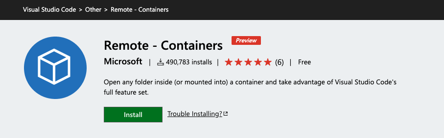
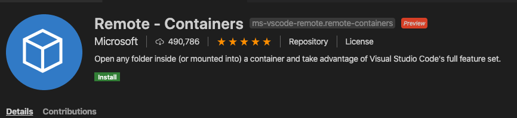
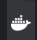
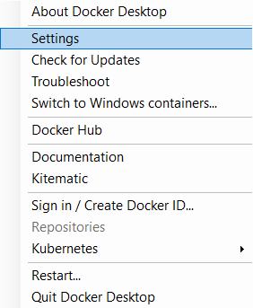
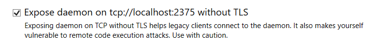
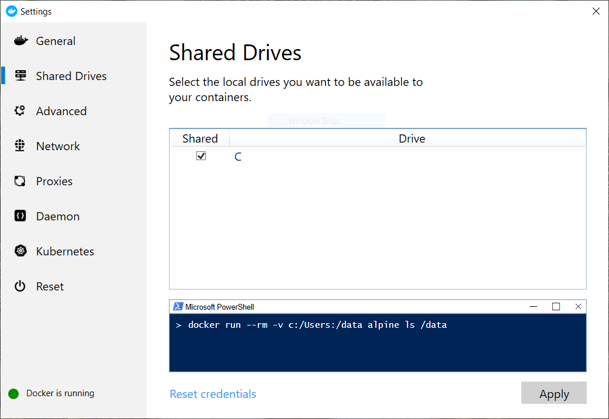
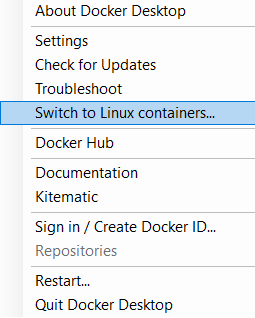
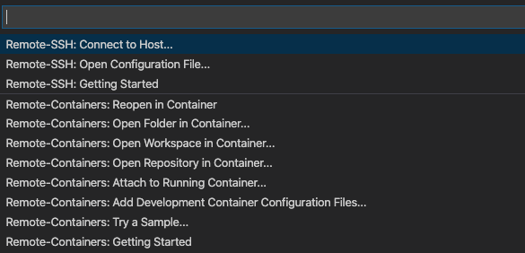
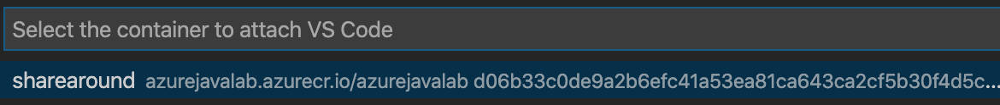

# Prerequisites

## What are we going to do in this step

In this step we are going to setup the environment you will need for this
training.

## Initial steps

Create an empty directory called `sharearound` on your local filesyatem.

```shell
mkdir sharearound
```

And then execute the command below to change into it:

```shell
cd sharearound
```

Then clone the repository using:

```shell
git clone https://github.com/microsoft/migrate-java-ee-app-to-azure-training
```

## Setting up the environment

You have 2 options to satisfy the remaining prerequisites needed to complete this training.

1. [Docker Container option](#docker-container-option)
2. [Self install option](#alternate-option)

## Docker Container option

1. Install Visual Studio Code (VSCode)
1. Install the Remote Containers extension for VSCode
1. Install Docker Desktop
1. Run the Docker container
1. Log into Azure
1. Set your default subscription
1. Set the default working directory
1. Determine your unique id
1. Set the BASEDIR variable

### Install Visual Studio Code (VSCode)

Open your browser to [Download Visual Studio Code](https://code.visualstudio.com/Download).

Click on the button appropriate for your OS and install VSCode

### Install the Remote Containers extension for VSCode

Open your browser to [Remote - Containers](https://marketplace.visualstudio.com/items?itemName=ms-vscode-remote.remote-containers)



Click on the `Install` button.

It will ask you if you want to open this URL in VSCode.

Confirm that you want to open it in VSCode.



Click on the `Install` button.

*Note if you do not see the `Install` button you already have the extension
installed and you can continue on*

### Install Docker

*Note if you do not have a Docker ID yet you will need to sign up for one as you
will need it to download the Docker Desktop*

**Note you DO NOT have to go through the Docker tutorial, you only need to
download the Docker Desktop installer and then install Docker Desktop**

> :stop_sign: if at any time you are asked to reboot your machine please do so

Go to [Get Started with Docker](https://www.docker.com/get-started)

And follow the directions there.

### Run the Docker container

#### If you are running on a non-Windows OS

Start the Docker container using the following command line:

```shell
docker run --name sharearound -v $PWD:/mnt -v /var/run/docker.sock:/var/run/docker.sock -d azurejavalab.azurecr.io/azurejavalab
```

> :pushpin: if you want to build the Docker container yourself execute the build
> script (build.sh / build.cmd) on your local machine.

#### If you are running on Windows



Open the settings for Docker Desktop for Windows by clicking on the little whale
icon on your taskbar.



And then click `Settings`.



Make sure `Expose daemon on tcp://localhost:2375 without TLS` is checked.

You will also need to make sure you share your `C` drive so we can store the trainig material on your local drive.



Make sure the `C` drive is checked and click `Aoply`,

We need to verify Docker Desktop for Windows is set to run Linux containers.


Click on the little whale icon on your taskbar again.



See if it says `Switch to Windows containers...` or
`Switch to Linux containers...`.

If it says `Switch to Linux containers...` please click it, otherwise no action is
required.

> :stop_sign: The folliowing command line MUST be executed using `cmd.exe`

And now execute the command line below inside of the `sharearound` directory you created
before to start the Docker container:

```shell
docker run --name sharearound -v %CD%:/mnt -e DOCKER_HOST=tcp://docker.for.win.localhost:2375 -d azurejavalab.azurecr.io/azurejavalab
```

> :bulb: if you want to build the Docker container yourself execute the build
> script (build.sh / build.cmd) on your local machine.

#### Next steps are for all OS-es when using the Docker container

Now start VSCode

Type `Ctrl + Shift + P` (or `Cmd + Shift + P` if you are on macOS)

You should see a window like the one below show up.



Enter the following in the prompt and press enter:

```shell
Remote-Containers: Attach to Running Container
```

The next step is to select the remote container we want to connect to.



Click `sharearound` to attach to the remote Docker container.

This opens a 2nd window of VSCode that is attached to the running Docker
container.

This is the VSCode window we will use for the duration of the training.

> Hint: you can spot which VSCode window is the remote VSCode window by
> looking at the title of the window. It should contain [Container ....

Switch to the remote window of VSCode.

Type `Ctrl + Shift + P` (or `Cmd + Shift + P` if you are on macOS)

Enter the following in the prompt and press Enter:

```shell
Terminal: Create New Integrated Terminal
```

This will open a new integrated terminal.

The remainder of the steps are going to be performed in the integrated terminal
unless noted otherwise.

### Set the default working directory

Lets make sure that your VSCode Explorer view is open to the `/mnt` directory.

Execute the command line below:

```shell
code -r /mnt
```

Lets also make sure the integrated shell is open in the `/mnt` directory.

Execute the command line below:

```shell
cd /mnt
```

### Login into Azure

To login into Azure execute the following command line:

````shell
az login
````

Follow the directions given and return here when you are done.

### Set your default subscription

We need to set the subscription you want to use for this training.

To get a list of your subscriptions execute the command line below:

````shell
az account list --output table
````

Now replace `subscription-id`  with the `SubscriptionId` you determined you want to use in the command line below.

Execute the command line to set the default subscription id:

```shell
az account set --subscription "subscription-id"
```

### Determine your unique id

Some of the resources we are going to create need to have a unique id. In a class
room setting ask your proctor what the value of the `UNIQUE_ID` environment
variable needs to be. If you are doing this training by yourself use the same
timestamp in `YYYYMMDDHHSS` format as the value for `UNIQUE_ID`.

Replacing `FILL_THIS_IN` with the value for `UNIQUE_ID` you determined above
and execute the command line below:

```shell
export UNIQUE_ID=FILL_THIS_IN
```

Now we are going to set the BASEDIR environment variable:

Execute the command line below:

```shell
export BASEDIR=$PWD
```

You are now ready to start the training!

[Next](../01-initial/README.md)

## Self install option

You will need to install the following tools:

1. An editor / IDE
2. Docker
3. Docker Compose
4. Azure CLI
5. Azul JDK 8
6. Maven 3.6.3
7. bash
8. curl
9. kubectl
10. psql

### Setup your environment

> :stop_sign: the training material assumes all commands are run in a bash shell

Using a bash shell follow the steps above  starting at [Login to Azure](#login-into-azure).

## What you accomplished

1. You have setup your environment to start the training.

[Next](../01-initial/README.md)
